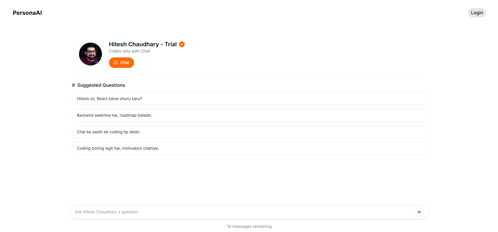
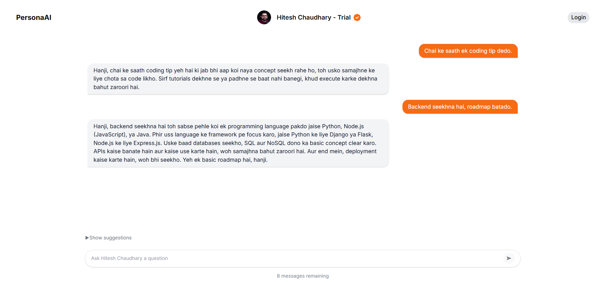

# 🤖 AI Persona Chat App

An interactive **AI-powered chat application** where you can talk to different online personalities, creators, and fictional characters through customized **AI personas**.

Built for speed, scalability, and fun experimentation using **OpenAI SDK**, **Google Gemini-Flash-2.5**, and **Vercel AI SDK** for blazing-fast UI.

---

## [LIVE](https://ai-persona-chat-yhp9.vercel.app/)

## 🎥 Demo 

[Watch the Demo]([https://youtu.be/your-video-id](https://youtu.be/lIR_G7MZGFA)) 

## 📸 Preview

### 💻 Home Page


### 🎭 Persona Interface



### 🎭 Persona Chat Example



---

## ✨ Features

- 🧑‍🎭 **Multiple Personas**  
  Talk to creators like Hitesh Chaudhary, Piyush Garg, Manu Arora, Bhuvan Bam, Zakir Khan, Ashneer Grover, ACP Pradyuman, and more.  
  Each persona has a **unique style, tone, and sample prompts**.

- 💬 **Streaming Chat**  
  Enjoy **real-time AI responses** with token streaming for smooth typing effect.

- ⚡ **Fast UI with Vercel AI SDK**  
  Leveraging Vercel's `ai` components and hooks for seamless state management, minimal boilerplate, and production-ready DX.

- 🌍 **Multilingual Hinglish Support**  
  Personas mix **Hindi + English** naturally, just like their real counterparts.

- 📱 **Responsive Design**  
  Optimized for desktop and mobile devices.

- 🔒 **API Safety & Limits**  
  Built-in **rate limits** and free usage quota for fair usage.

- 💾 **Local Storage Chat Persistence**  
  Conversations are automatically saved to local storage, so you can continue your chats even after refreshing or closing the browser.

---

## 🆓 Free Limit

- Each user gets **10 free messages per persona**.
- Supported providers:
  - **OpenAI**
  - **Google Gemini** (`gemini-flash-2.5`)

---

## 🛠️ Tech Stack

- **Frontend**: Next.js + React + Tailwind CSS
- **AI Elements**: Vercel AI Elements for faster build
- **LLM Providers**:
  - OpenAI SDK
  - Gemini Flash 2.5 (super-fast, optimized for real-time chat)
- **Deployment**: Vercel

---

## 🚀 Installation

Clone the repo:

```bash
git clone https://github.com/raaaghavv/ai-persona-chat.git
cd ai-persona-chat
```

Install dependencies:

```bash
npm install
```

Set up API keys in .env (choose one or both):

```bash
# For OpenAI
export OPENAI_API_KEY=your_key_here

# For Gemini
export GEMINI_API_KEY=your_key_here
```

Run the dev server:

```bash
npm run dev
```

---

## ▶️ Usage

1. Select a persona (e.g., Bhuvan Bam, CarryMinati, Zakir Khan).
2. Ask a question or use a suggested prompt.
3. Get funny, witty, or emotional replies in their signature style.
4. Messages stream in real-time for an immersive chat experience.
5. Your chat history is automatically saved - return anytime to continue conversations.

---

## 🧩 Future Improvements

- 🎭 Add more personalities and fictional characters
- 📝 User-created custom personas
- 🔊 Voice Mode (text-to-speech with persona voices)
- 📈 Usage analytics + history
- ☁️ Cloud sync for chat history across devices
- 📤 Export chat conversations
- 🔍 Search through chat history
